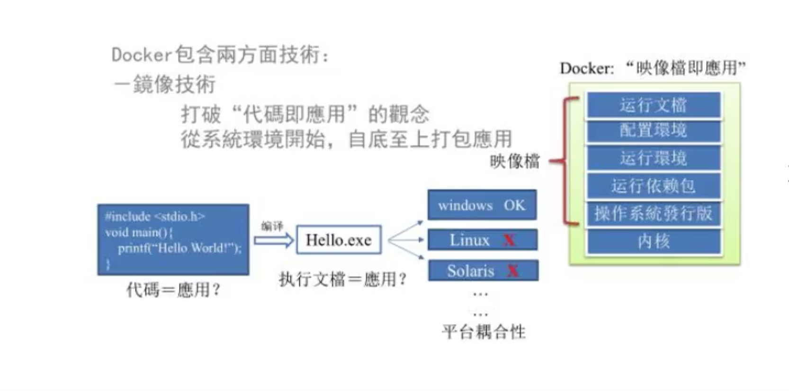

# 1. docker为什么会出现？

## 1.1 docker解决的问题

> 开发人员利用 docker 可以消除协作编码时 “在我的机器上不可正常工作” 的问题。

传统上认为，软件编码开发/测试结束后，所产出的成果即是程序或是能够编译执行的二进制字节码等(java为例)。而为了让这些程序可以顺利执行，开发团队也得准备完整的部署文件，让运维团队得以部署应用，开发需要清楚地告诉运维部署团队，用的全部配置文件+所有软件环境。

不过，即便如此，仍然常常发生部署失败的情况。

Docker镜像的出现，使得 docker 得以打破过去【程序即应用】的观念。透过镜像将作业系统核心除外，运作应用程序所需要的系统环境，由下而上打包，达到应用程序跨平台间的无缝接轨运作。

