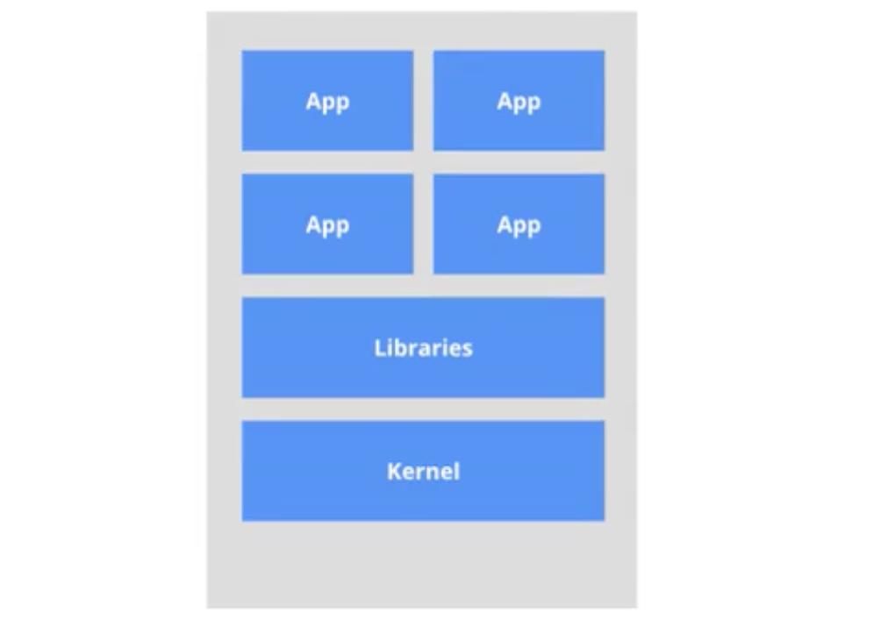
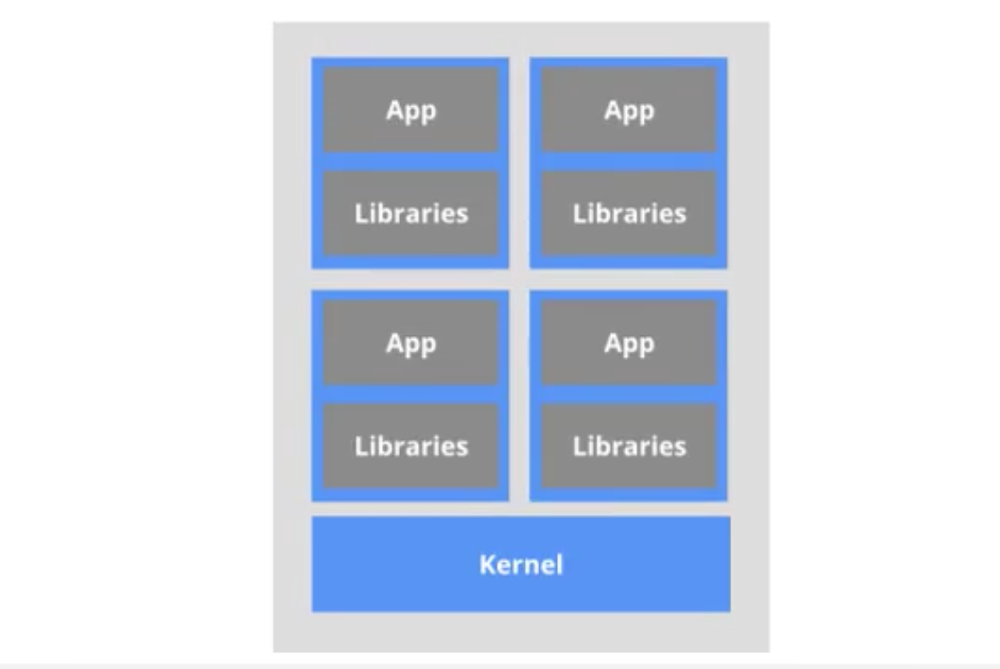

# 4. docker能干什么？

## 4.1 传统虚拟机技术

虚拟机(Virtual Machine)就是带环境安装的1种解决方案。

它可以在一种操作系统里面运行另一种操作系统，比如在 Windows系统里面运行 Linux系统。

应用程序对此毫无感知，因为虚拟机看上去跟真实的一模一样，而对于底层系统来说，虚拟机就是一个普通文件，不需要了就删除，对其他部分毫无影响。这类虚拟机完美的运行了另一套系统，能够使应用程序、操作系统和硬件三者间的逻辑不变。

### 虚拟机缺点
* 1.占用资源多
* 2.冗余步骤多
* 3.启动慢

## 4.2 容器虚拟化技术

由于虚拟机存在这些缺点，Linux发展出了另一种虚拟化技术: Linux容器(Linux Containers, LXC)。

Linux容器不是模拟一个完整的操作系统，而是对进程进行隔离。有了容器，就可以将软件运行所需的所有资源打包到1个隔离的容器中。

容器与虚拟机不同，不需要捆绑一整套操作系统，只需要软件工作所需的库资源和设置。系统因此变得高效轻量并保证部署在任何环境中的软件都能始终如一地运行。

## 传统虚拟机技术 vs docker
* 传统虚拟机技术是虚拟出一套硬件后，在其运行一个完整操作系统，在该操作系统上再运行所需应用进程

## 4.3 DevOps(开发/运维)
一次构建，随处运行。
* 更快速的应用交付和部署
* 更便捷的升级和扩缩容
* 更简单的系统运维
* 更高效的计算资源利用
