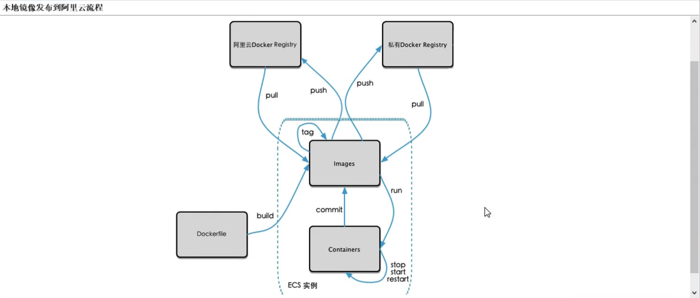
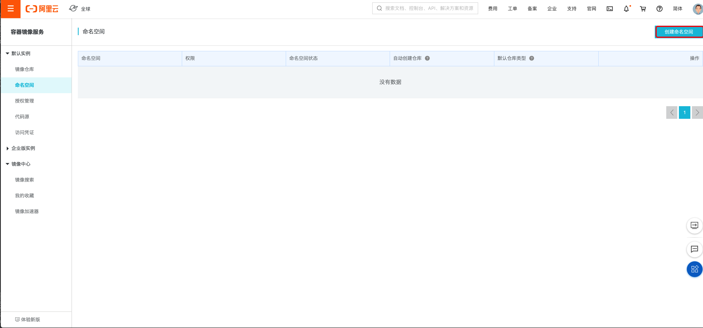
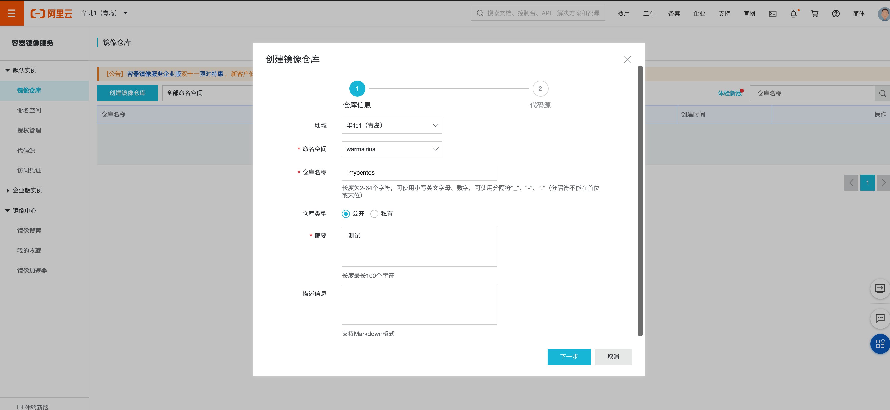
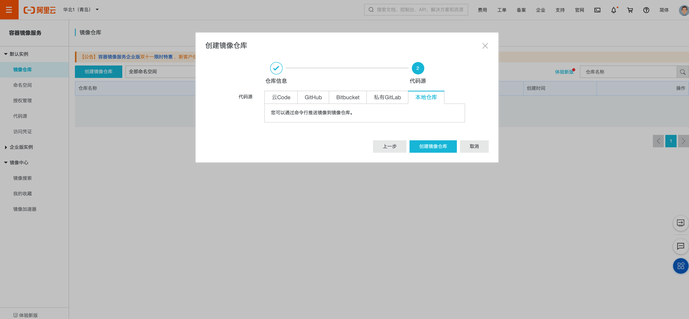
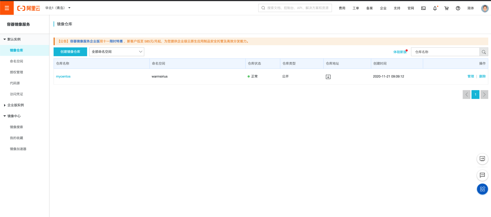

# 1.本地镜像推送到阿里云

## 1.1 本地镜像发送到阿里云流程



## 1.2 镜像生成方法

### 方式一: DockerFile + docker build
* 1.编写dockerfile
* 2.然后docker build

### 方式二: 容器创建新镜像

```shell script
docker commit [OPTIONS] 容器ID [REPOSITORY:TAG]
```
#### 常用选项
* -a: 提交的镜像作者
* -m: 提交时说明文字

#### 案例

```shell script
[root@www ~]# docker run -it -d mycentos:1.1
80722699854e5ff65b54d6744b0ea5b5232616794acaebd146b87889e836ffd4
```

```shell script
[root@www ~]# docker ps
CONTAINER ID        IMAGE               COMMAND                  CREATED             STATUS              PORTS                                NAMES
80722699854e        mycentos:1.1        "/bin/sh -c /bin/bash"   5 seconds ago       Up 5 seconds        8080/tcp                             agitated_mendeleev
81bf83223a11        redis:3.2           "docker-entrypoint.s…"   10 hours ago        Up 10 hours         0.0.0.0:6379->6379/tcp               focused_ritchie
dfcbff956c8c        mysql:5.7           "docker-entrypoint.s…"   10 hours ago        Up 10 hours         33060/tcp, 0.0.0.0:12345->3306/tcp   mysql
[root@www ~]# docker commit -a yuanjun -m 'my newcentos with vim and ifconfig' 80722699854e mycentos:1.1
sha256:9f2891cc0daae6ef185bb01b70949ebf944cacdc903613c834c22866d15a80e2
[root@www ~]#
```


## 1.3 阿里云创建镜像仓库

1.登录阿里云[https://dev.aliyun.com/search.html](https://dev.aliyun.com/search.html) ，进入到 【容器镜像服务】-【管理控制台】-【镜像仓库】

2.创建命名空间


3.查看命名空间


4.创建镜像仓库




5.查看镜像仓库



## 1.4 推送/拉取 镜像到阿里云

1.登录阿里云Docker Registry
```shell script
$ sudo docker login --username=warmjunee registry.cn-qingdao.aliyuncs.com
```
用于登录的用户名为阿里云账号全名，密码为开通服务时设置的密码。您可以在访问凭证页面修改凭证密码。

2.从Registry中拉取镜像
```shell script
$ sudo docker pull registry.cn-qingdao.aliyuncs.com/warmsirius/mycentos:[镜像版本号]
```

3. 将镜像推送到Registry
```shell script
$ sudo docker login --username=warmjunee registry.cn-qingdao.aliyuncs.com
$ sudo docker tag [ImageId] registry.cn-qingdao.aliyuncs.com/warmsirius/mycentos:[镜像版本号]
$ sudo docker push registry.cn-qingdao.aliyuncs.com/warmsirius/mycentos:[镜像版本号]
```
请根据实际镜像信息替换示例中的[ImageId]和[镜像版本号]参数。

4.选择合适的镜像仓库地址

从ECS推送镜像时，可以选择使用镜像仓库内网地址。推送速度将得到提升并且将不会损耗您的公网流量。

如果您使用的机器位于VPC网络，请使用 registry-vpc.cn-qingdao.aliyuncs.com 作为Registry的域名登录。

5.示例

使用"docker tag"命令重命名镜像，并将它通过专有网络地址推送至Registry。

```shell script
$ sudo docker images
REPOSITORY                                                         TAG                 IMAGE ID            CREATED             VIRTUAL SIZE
registry.aliyuncs.com/acs/agent                                    0.7-dfb6816         37bb9c63c8b2        7 days ago          37.89 MB
$ sudo docker tag 37bb9c63c8b2 registry-vpc.cn-qingdao.aliyuncs.com/acs/agent:0.7-dfb6816
```

使用 "docker push" 命令将该镜像推送至远程。

```shell script
$ sudo docker push registry-vpc.cn-qingdao.aliyuncs.com/acs/agent:0.7-dfb6816
```
