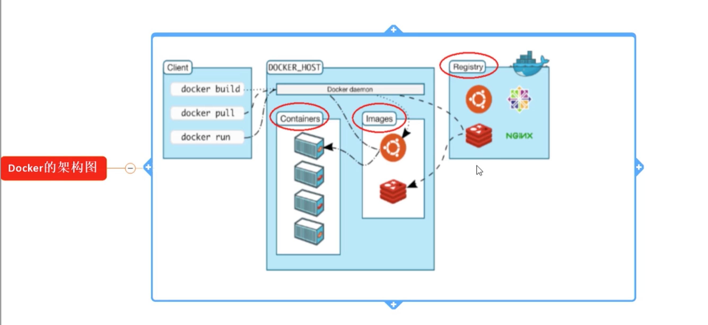
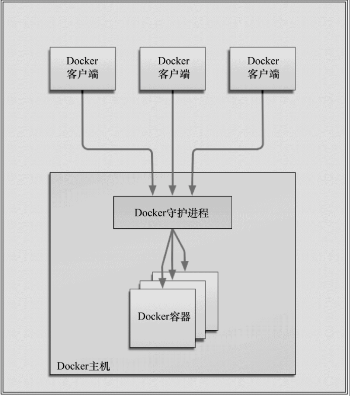

# 2. docker基本组成

## 2.1 docker架构

## 2.2 docker 核心组件
* docker 客户端 和 服务器(docker引擎)
* 镜像(image)
* 容器(container)
* 仓库(repository)

## 2.3 docker 客户端 和 服务器

docker 是1个 客户端/服务器(C/S) 架构的程序。

docker 客户端: 只需向 docker服务器或守护进程发出请求，服务器或守护进程 将完成所有工作并返回结果
docker 守护进程: 也称为 docker引擎。

## 2.4 镜像(image)
镜像是基于联合（Union）文件系统的一种层式的结构，由一系列指令一步一步构建出来。

docker镜像就是一个只读的模板。 镜像可以用来创建Docker容器，一个镜像可以创建很多容器。

容器与镜像的关系类似于面向对象编程中的对象与类。

| Docker | 面向对象 |
|---- |---- |
| 镜像 | 类 |
| 容器 | 对象 |

## 2.5 容器
Docker利用 容器 独立运行的一个或一组应用。容器是用镜像创建的运行实例。

它可以被启动、开始、停止、删除。 每个容器都是相互隔离的、保证安全的平台。

可以 **把容器看做是 一个简易版本的Linux环境(包括 root用户权限、进程空间、用户空间和网络空间等) 和运行在其中的应用程序**。

容器的定义和镜像几乎一模一样，也是一堆层的统一视角，唯一区别在于容器的最上面那一层是可读可写的。

> Docker**推荐 单个容器 只运行 一个应用程序或进程**， 这样就形成了一个分布式的应用程序模型，在这种模型下，应用程序或服务都可以表示为一系列内部互联的容器，从而使分布式部署应用程序，扩展或调试应用程序都变得非常简单，同时也提高了程序的内省性

## 2.6 仓库(Registry)
仓库是 集中存放镜像文件 的场所。

仓库 vs. 仓库注册服务器: 仓库注册服务器上往往存放着多个仓库，每个仓库中又包含了多个镜像，每个镜像有不同的 tag。

仓库分为: 公开仓库(Public) 和 私有仓库(Private)两种形式。

最大的公开仓库: Docker Hub，存放了数量庞大的镜像供用户下载。国内的公开仓库包括阿里云、网易云等。

## 2.7 小结
docker本身就是1个容器运行载体或称之为 管理引擎。

我们把应用程序和配置依赖打包好形成1个可交付的运行环境，这个打包好的运行环境就似乎 image文件。只有通过这个镜像文件才能生成docker容器。

image文件可以看做是容器的模板。Docker根据image文件生成容器的实例，同一个image文件，可以生成多个同时运行的容器实例。

* image文件生成的容器实例，本身也是1个文件，只可读，称为镜像文件
* 1个容器运行1种服务，当我们需要的时候，就可以通过docker客户端创建1个对应的运行实例，也就是容器
* 仓库是存放一堆镜像的地方，我们可以把镜像发布到仓库中，需要的时候从仓库中拉下来就可以
