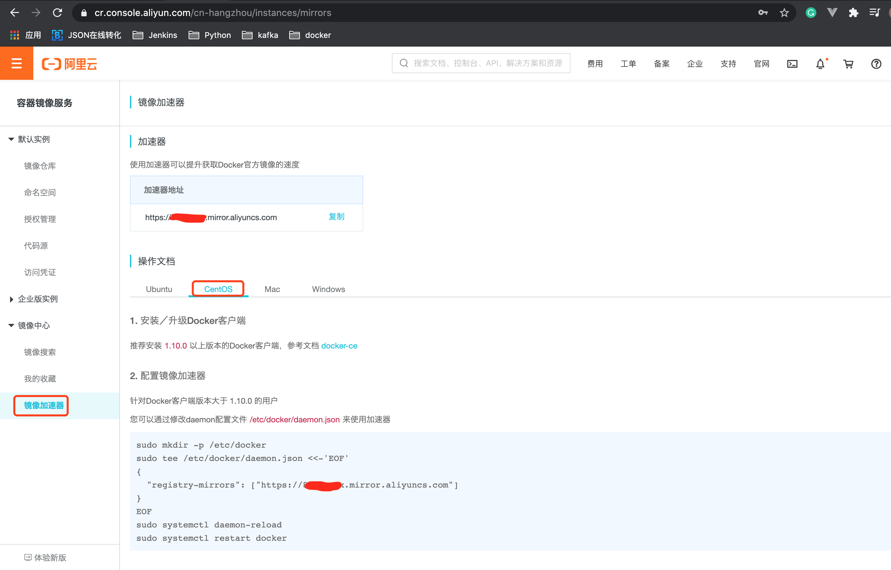

# 2. 阿里云镜像加速器配置

1.访问阿里云镜像地址: [https://developer.aliyun.com/mirror/](https://developer.aliyun.com/mirror/)

2.注册属于自己的阿里云账号(可复用支付宝或淘宝)

3.获得加速器地址连接
* 登录阿里云开发者平台
* 获取加速器地址


4.配置本机的Docker运行镜像加速器

* CentOS 6.8:

```shell script
vi /etc/sysconfig/docker

# 修改other_args参数
other_args="--registry-mirror=你的阿里云镜像加速器地址"
```

* CentOS 7.0+:
```shell script
vi /etc/docker/daemon.json

#粘贴下面内容
{
  "registry-mirrors": ["https://你的阿里云镜像加速器地址.mirror.aliyuncs.com"]
}
```


5.重新启动 Docker后台服务:
* CentOS 6.8:
```shell script
service docker start
```

* CentOS 7:
```shell script
systemctl daemon-reload
systemctl restart docker 
```

6.Linux系统下配置完加速器需要检查是否生效
```shell script
ps -ef | grep docker
```