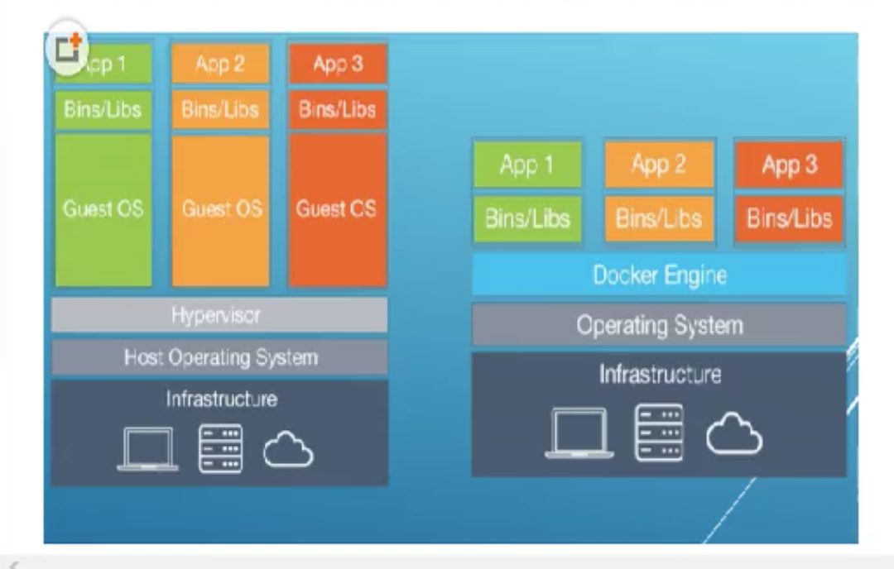

# 6. docker运行底层原理

## 6.1 Docker是怎么工作的？

Docker是一个 Client-Server 结构的系统，Docker守护进程运行在主机上，然后通过 Socket 连接从客户端访问，守护进程从客户端接受命令并管理运行在主机上的容器。

容器，是一个运行时环境，也就是前面所说集装箱。

## 6.2 为什么 Docker 比 VM 快？
* 1.docker有着比虚拟机更少的抽象层。

由于 Docker不需要 Hypervisor 实现硬件资源虚拟化，运行在docker容器上的程序直接使用的都是实际物理机的硬件资源。

因此在 CPU、内存利用率 上docker将会在效率上有明显优势。

* 2.docker利用的是宿主机内核，而不需要 GuestOS。

因此，当新建1个容器时，docker不需要和虚拟机一样重新加载一个操作系统内核。仍然避免引寻、加载操作系统内核 这个比较费时费资源的操作，当新建一个虚拟机时，虚拟机软件需要加载 Guest OS，这个新建过程是分钟级别的。

而docker直接利用宿主机操作系统，则省略了这个过程，新词新建1个docker容器只需要几秒钟。

| | Docker容器 | 虚拟机(VM) |
|----|----|----|
| 操作系统 | 与宿主机共享 OS | 宿主机OS上运行虚拟机OS |
| 存储大小 | 镜像小，便于存储与传输 | 镜像庞大(vmdk、vdi等) |
| 运行性能 | 几乎无额外性能损失 | 操作系统额外的CPU、内存消耗 |
| 移植性 | 轻便、灵活，适应于Linux | 笨重，与虚拟化技术耦合度高 |
| 硬件亲和性 | 面向软件开发者 | 面向硬件运维者 |

