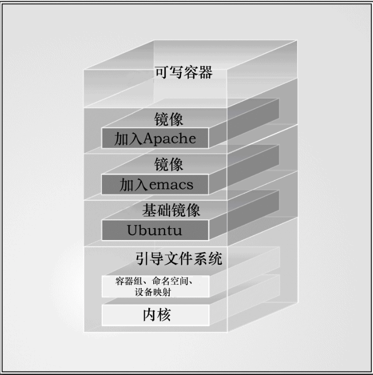
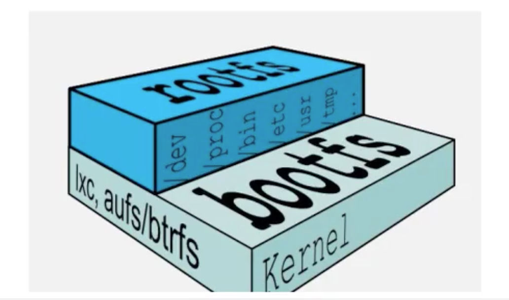

# 2. 镜像原理

## 2.1 Union FS(联合文件系统)
Union FS(联合文件系统): Union文件系统(Union FS)是一种分层、轻量级并且高性能的文件系统，它支持对文件系统的修改作为一次提交来一层层的叠加，同时可以将不同目录挂载到同一个虚拟文件系统下。

Union 文件系统是 Docker镜像的基础。

镜像可以通过分层来继承，基于基础镜像(没有父镜像)，可以制作各种具体的应用镜像。

### 特性

`联合加载`: 一次同时加载多个文件系统，但是外表看起来，只能看到1个文件系统。

联合加载会把各层文件系统叠加起来，这样最终的文件系统会包含所有底层的文件和目录。

## 2.2 镜像文件系统原理
docker镜像实际上是一层一层的文件系统组成，这种层级的文件系统是Union FS。

### 最底层: 引导文件系统(bootfs)
最底端是一个引导文件系统，即 `bootfs`，这很像典型的 Linux/Unix的引导文件系统。

bootfs(boot file system)主要包含 bootloader 和 kernel。

#### bootloader

主要是引导加载 kernel，Linux刚启动时会加载 bootfs 文件系统，在Docker镜像最底层是 bootfs。这一层与我们典型的Linux/Unix系统是一样的，包含 boot加载器和内核。

> Docker用户几乎永远不会和引导文件系统有什么交互。实际上，当一个容器启动后，它将会被移到内存中，而引导文件系统则会被卸载（unmount），以留出更多的内存供initrd磁盘镜像使用。

### 第二层: root文件系统(rootfs)

Docker镜像的第二层是root文件系统 `rootfs`，它位于引导文件系统之上，包含的就是典型 Linux系统中的 /dev、/proc、/bin、/etc等标准目录和文件。

rootfs可以是一种或多种操作系统（如Debian或者Ubuntu文件系统）。

> 在传统的Linux引导过程中，root文件系统会最先以 只读的方式加载，当引导结束并完成了完整性检查之后，它才会被切换为读写模式。
>
> 但是在Docker里，root文件系统永远只能是只读状态，并且Docker利用联合加载（union mount）技术又会在root文件系统层上加载更多的只读文件系统。

rootfs就是各种不同操作系统发行版本，比如Ubuntu、CentOS等。

### 写时复制

当Docker第一次启动一个容器时，初始的读写层是空的。当文件系统发生变化时，这些变化都会应用到这一层上。

比如，如果想修改一个文件，这个文件首先会从该读写层下面的只读层复制到该读写层。该文件的只读版本依然存在，但是已经被读写层中的该文件副本所隐藏。

## 2.3 镜像小结
**问题: 平时安装虚拟机的CentOS都是好几个G，为什么docker才200M？**

> 答: 对于1个精简OS，rootfs可以很小，主需要包括 最基本的命令、工具和程序就可以了，因为底层直接用 Host 的 kernel，自己只需要提供 rootfs就行了。
>
> 由此可见，对于不同的Linux发行版，bootfs基本是一致的，rootfs会有差别，因此不同发行版本可以公用 bootfs。
