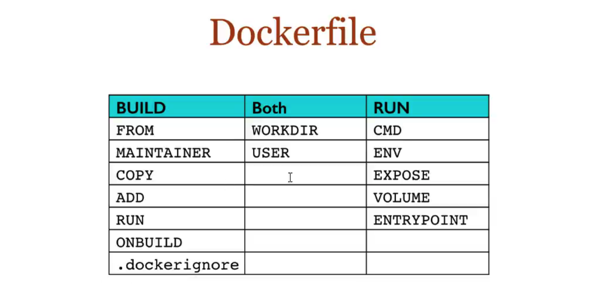

# 3. DockerFile 保留字指令

## 3.1 DockerFile 保留字
### FROM

基础镜像，当前新镜像是基于哪个镜像的。

### MAINTAINER

镜像维护者的姓名和邮箱地址。

### RUN

容器构建时需要运行的命令，如Linux命令。

### EXPOSE

当前容器对外暴露出的端口号。

### WORKDIR

指定在创建容器后，终端默认登录进来的工作目录，一个落脚点。

### ENV

用来在构建镜像过程中设置环境变量。


如: `ENV MY_PATH /usr/mytest`

这个环境变量可以在后续的任何RUN指令中使用，就如同在命令前面指定了环境变量前缀一样，也可以在其他指令中直接使用这个环境变量。

如: `WORKDIR $MY_PATH`

### ADD

将宿主机目录下的文件拷贝进镜像，且 ADD 命令会 自动处理 URL 和 解压tar压缩包。

### COPY

类似 ADD，拷贝文件和目录到镜像中。

将从构建上下文目录中 <源路径>的文件/目录 复制到新的一层的镜像内的 <目标路径> 位置

```shell script
COPY src dest
COPY ["src", "dest"]
```
### VOLUME

容器数据卷，用于数据保存和持久化工作。

### CMD

指定1个容器启动时要运行的命令

#### CMD容器启动命令

CMD指令的格式 和 RUN 相似，也是两种格式:

* shell格式: 
```shell script
CMD 命令
```

* exec格式:
```shell script
CDM ["可执行文件", "参数1", "参数2", ...]
```

* 参数列表格式:

指定了ENTRYPOINT后，用CMD指定具体的参数。
```shell script
CMD ["参数1", "参数2", ...]
```

DockerFile中可以有多个CMD命令，但只有最后1个命令生效，CMD 会被docker run之后的参数替换

### ENTRYPOINT

指定1个容器启动时要运行的命令

ENTRYPOINT的目的和CMD一样，都是在指定容器启动程序及参数。

### ONBUILD

当构建1个被继承的 DockerFile时运行命令，父镜像在被子继承后父镜像的 onbuild 被触发。

## 3.2 总结

